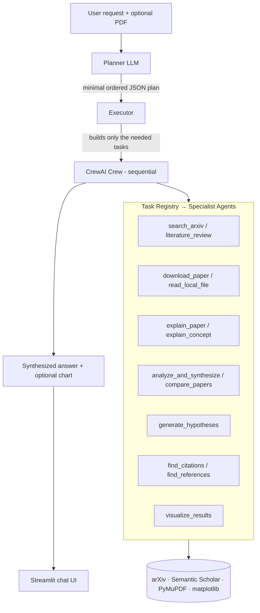

# 🧬 Agentic Research Assistant

An agentic research assistant that turns a free-form request like
*"find recent papers on LoRA fine-tuning and give me a deep analysis"* into a
**dynamically planned, multi-agent workflow** over arXiv and Semantic Scholar.

Instead of a fixed pipeline, an LLM **planner** reads each request and emits a
minimal, ordered execution plan. An **executor** then builds only the tasks that
plan calls for, wires each task's context to the outputs of the earlier ones,
and runs a crew of specialist agents ([CrewAI](https://github.com/crewAIInc/crewAI))
to carry them out.

---

## Why it's interesting

Most "research assistant" demos hard-code one chain of steps. This one **decides
the steps at runtime**:

- *"summarize this uploaded PDF"* → `read_local_file → explain_paper`
- *"find papers on diffusion models"* → `search_arxiv`
- *"survey the field of MoE architectures"* → `literature_review`
- *"generate hypotheses on X, then find supporting papers, then analyze"* →
  `generate_hypotheses → search_arxiv → analyze_and_synthesize`

The planner is constrained to a registry of known tasks, so it stays grounded —
it composes existing capabilities rather than hallucinating new ones.

## Architecture



**The flow, concretely:**

1. **Plan** — [`planner.py`](planner.py) sends the request plus the task registry
   to Gemini and gets back a JSON plan (`intent_summary` + ordered `tasks`).
2. **Execute** — [`executor.py`](executor.py) instantiates only those tasks from
   [`task_registry.py`](task_registry.py), resolves `$task_N_output` references
   between steps, and runs them sequentially.
3. **Answer** — the final crew output is rendered in the Streamlit UI, with any
   matplotlib chart the visualization agent produced.

## Features

- 🧠 **LLM task planning** grounded in a fixed task registry
- 🔗 **Context passing** between steps (`$task_N_output` references)
- 📚 **arXiv search & literature review** with natural-language time filters
  (*"after 2020"*, *"last 3 years"*, *"between 2019 and 2022"*)
- 🔎 **Citation graph traversal** (forward & backward) via Semantic Scholar
- 📄 **Local PDF ingestion** with PyMuPDF
- 📊 **Automatic result visualization** — extracts real numbers and plots them,
  and *refuses to invent data* when a paper is purely qualitative
- 💬 **Streamlit chat UI** with PDF upload
- 🔌 **MCP server** ([`server.py`](server.py)) exposing the assistant as a tool

## Quickstart

Requires Python 3.11+ and [uv](https://docs.astral.sh/uv/).

```bash
git clone https://github.com/SomanGaurav/Agentic_Research_Assistant.git
cd Agentic_Research_Assistant

# 1. Configure secrets
cp .env.example .env      # then edit .env and add your Gemini API key

# 2. Install dependencies
uv sync

# 3. Launch the UI
uv run streamlit run ui.py
```

Or run a single request from the command line:

```bash
uv run python agentic_crew.py
```

### Environment variables

| Variable          | Required | Purpose                                             |
| ----------------- | -------- | --------------------------------------------------- |
| `GEMINI_API_KEY3` | ✅       | Planner + all agents ([Google AI Studio](https://aistudio.google.com/apikey)) |
| `S2_API_KEY`      | ⬜       | Higher Semantic Scholar rate limits (optional)      |

## Project structure

```
.
├── agentic_crew.py     # Entrypoint: run() → plan() → execute_plan()
├── planner.py          # LLM planner → JSON execution plan
├── executor.py         # Builds & runs the CrewAI crew from a plan
├── task_registry.py    # Task factories + descriptions the planner sees
├── agents/             # Specialist CrewAI agents (search, analysis, …)
├── tools/              # Semantic Scholar client
├── utils.py            # arXiv tools, PDF readers, LLM client, plotting
├── chart_runner.py     # Safely extracts & runs matplotlib code from output
├── ui.py               # Streamlit chat UI
├── server.py           # MCP server wrapper
└── tests/              # Pytest suite (planning logic, parsing, chart runner)
```

## Development

```bash
uv sync --extra dev
uv run ruff check .      # lint
uv run pytest -q         # tests
```

CI runs both on every push and pull request — see
[`.github/workflows/ci.yml`](.github/workflows/ci.yml).

## Roadmap

- [ ] Output evaluation harness (citation grounding, planner accuracy)
- [ ] Verify every cited paper traces back to a real search result (anti-hallucination)
- [ ] Persistent memory / RAG over previously read papers
- [ ] Tracing UI showing the plan and each agent's step

## License

MIT
